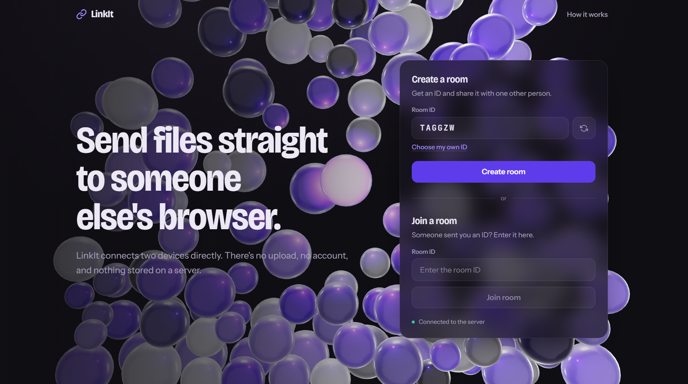
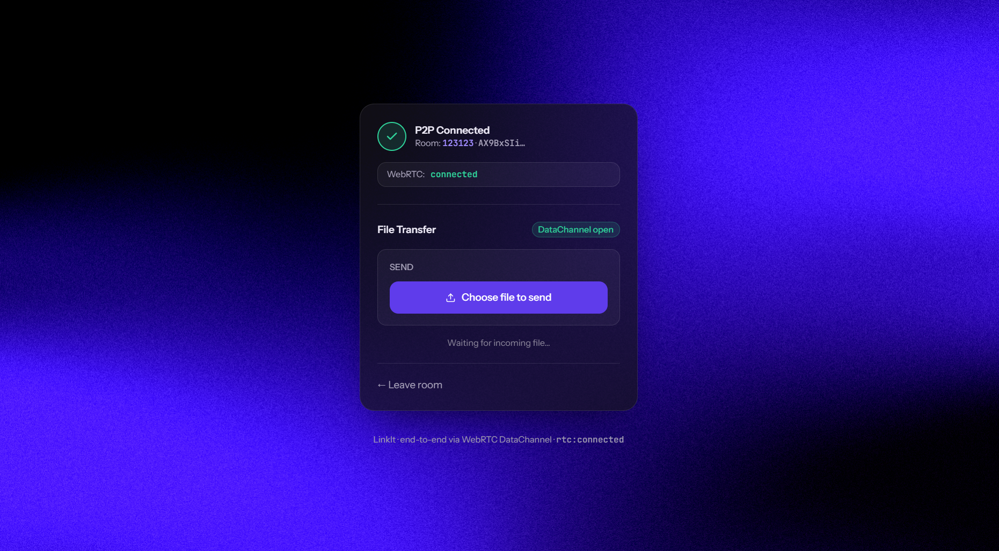
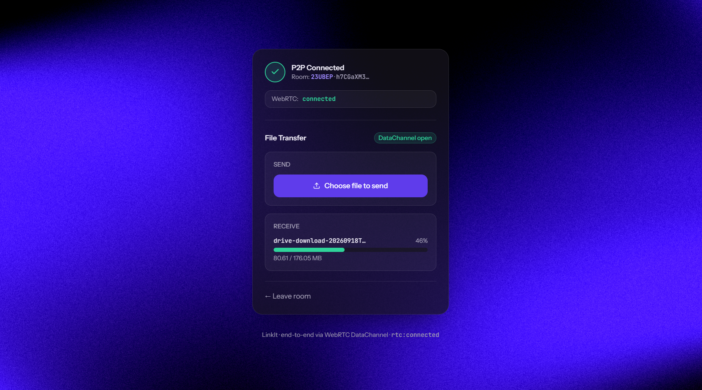
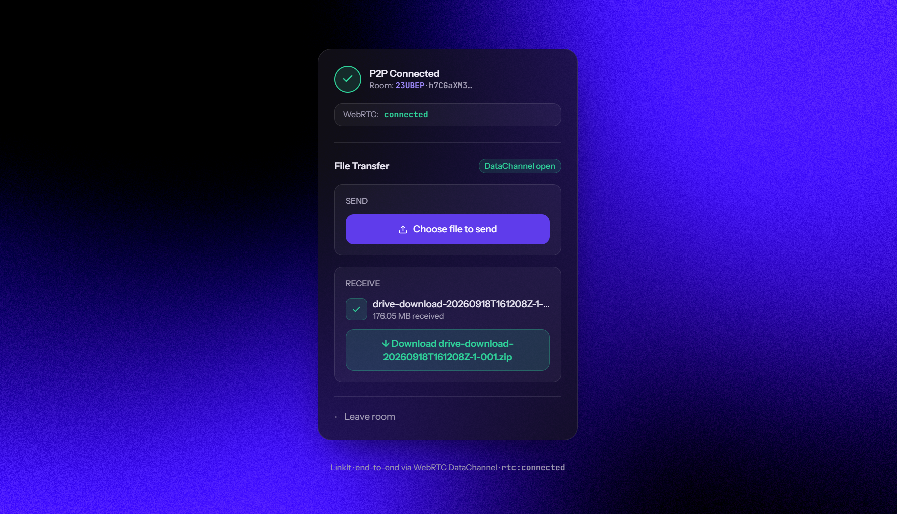
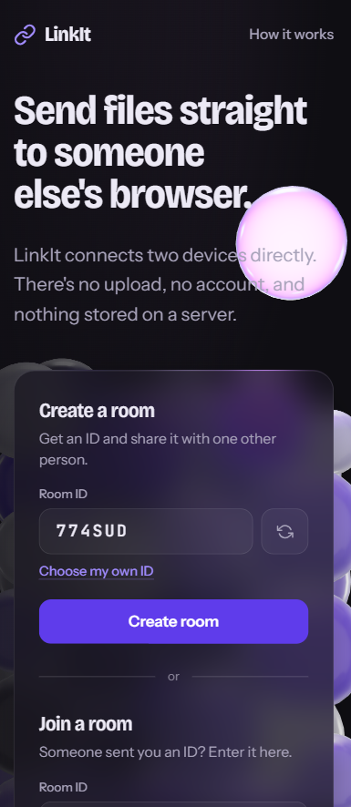

<div align="center">


# LinkIt

**Peer-to-peer file sharing, straight from your browser — no server ever touches your files.**

[](https://www.typescriptlang.org/)
[](https://react.dev/)
[](https://nodejs.org/)
[](https://socket.io/)
[](https://webrtc.org/)
[](https://zod.dev/)

</div>

---

## What is this?

LinkIt lets two people share a file directly, browser to browser, using
**WebRTC**. A small signaling server helps the two browsers find each
other and negotiate a connection — but once that connection is
established, the file itself never touches the server. No upload, no
storage, no server bandwidth bill that scales with file size.

## Screenshots

| Landing | Connected |
|---|---|
|  |  |

| Transferring | Received |
|---|---|
|  |  |

<div align="center">

| Mobile |
|---|
|  |

</div>

## Table of contents

- [Features](#features)
- [How it works](#how-it-works)
- [Tech stack](#tech-stack)
- [Project structure](#project-structure)
- [Getting started](#getting-started)
- [Environment variables](#environment-variables)
- [Available scripts](#available-scripts)
- [Known limitations](#known-limitations)
- [Roadmap](#roadmap)
- [Troubleshooting](#troubleshooting)
- [License](#license)

## Features

- 🔒 **True peer-to-peer** — files transfer directly between browsers over a WebRTC `DataChannel`; the server never sees file bytes
- 🌐 **Works across networks** — STUN for direct connections, with a TURN relay fallback for restrictive NATs/firewalls
- 🔁 **Resumable transfers** — if the connection drops mid-transfer, it resumes from the last received byte instead of restarting
- ✅ **Validated at every boundary** — every signaling message and file-transfer control message is checked with [Zod](https://zod.dev/) before being trusted
- 📊 **Live progress + backpressure handling** — large files send in chunks with buffer-aware pacing, so memory stays flat regardless of file size
- 🎨 **Clean, responsive UI** — minimal dark theme, works on desktop and mobile

## How it works

Two browsers can't connect to each other out of nowhere — they first
need to exchange a bit of setup information. That's what the signaling
server is for:

```
┌──────────┐      1. join room       ┌──────────────────┐      1. join room           ┌──────────┐
│ Browser A│ ───────────────────────▶│  Signaling Server │◀───────────────────────   │ Browser B│
│          │      2. offer/answer     │ (Express+Socket.IO)│      2. offer/answer     │          │
│          │◀──────────────────────▶ │   (relay only —    │ ◀──────────────────────▶│          │
│          │      3. ICE candidates   │  never sees files) │      3. ICE candidates   │          │
└────┬─────┘                          └───────────────────┘                           └────┬─────┘
     │                                                                                     │
     │                    4. Direct P2P connection (WebRTC DataChannel)                    │
     └─────────────────────────────────────────────────────────────────────────────────────┘
                                  File bytes flow here — server never involved
```

1. **Join a room** — both browsers connect to the signaling server and join the same room code
2. **Offer / Answer** — one browser creates a WebRTC "offer" (what kind of connection it wants), the other responds with an "answer" — both relayed through the signaling server
3. **ICE candidates** — both browsers discover possible network paths to reach each other (with help from a public STUN server) and exchange them
4. **Connected** — once a working path is found, the two browsers talk **directly**. The signaling server's job is done.
5. **File transfer** — the file is split into 16KB chunks and sent over the `DataChannel`, with backpressure handling so large files don't overwhelm memory. A resumable-transfer protocol means a dropped connection can pick back up instead of starting over.

## Tech stack

| Layer | Technology |
|---|---|
| Client | React 19 + TypeScript + Vite + Tailwind CSS |
| Signaling server | Express + Socket.IO + TypeScript |
| Shared validation | Zod (schemas shared between client and server via npm workspaces) |
| Peer connection | Native browser WebRTC API (`RTCPeerConnection`, `RTCDataChannel`) |
| NAT traversal | STUN (Google's public servers) + TURN (Metered.ca) |

## Project structure

```
linkit/
├── shared/               # Zod schemas — single source of truth for every
│   └── src/schemas.ts    # message shape crossing the client↔server boundary
├── server/                # Signaling server (Express + Socket.IO)
│   └── src/
│       ├── index.ts        # socket event handlers, all validated with Zod
│       └── rooms.ts        # in-memory room tracking (max 2 peers/room)
└── client/                 # React app
    └── src/
        ├── hooks/
        │   ├── useSocket.ts   # connects to the signaling server
        │   └── useWebRTC.ts   # owns the RTCPeerConnection lifecycle
        ├── components/
        │   ├── JoinRoom.tsx
        │   ├── FileTransfer.tsx
        │   └── ToastContainer.tsx
        └── App.tsx
```

## Getting started

### Prerequisites
- Node.js 18+
- A free [Metered.ca](https://dashboard.metered.ca/signup) account for your own TURN credentials (see below — the app falls back to shared demo credentials without this, which are unreliable)

### Install

```bash
git clone <this-repo-url>
cd linkit
npm install
```

### Configure environment

```bash
cp client/.env.example client/.env
```

Fill in your Metered.ca app name and API key (from the **TURN Server**
page on the dashboard, not the general account key) — see
[`HOW_TO_FIX_TURN.md`](HOW_TO_FIX_TURN.md) for exact steps.

### Run

```bash
npm run dev
```

This starts both the signaling server (`:3001`) and the client
(`:5173`) together. Open `http://localhost:5173` in two browser
tabs (or two devices on the same network — use the "Network" URL Vite
prints) to test a transfer.

## Environment variables

All in `client/.env` (see `client/.env.example`):

| Variable | Required | Purpose |
|---|---|---|
| `VITE_METERED_APP_NAME` | Recommended | Your Metered.ca app name, for private TURN credentials |
| `VITE_METERED_API_KEY` | Recommended | Your Metered.ca TURN Server API key |
| `VITE_FORCE_RELAY` | No | Set `true` to force all traffic through TURN only — useful for isolating whether TURN itself is working |

## Available scripts

Run from the repo root (`linkit/`):

| Command | What it does |
|---|---|
| `npm run dev` | Starts both server and client in dev mode |
| `npm run build` | Builds `shared` then `client` for production |
| `npm run build:shared` | Builds only the shared schema package |

## Known limitations

- No TURN fallback beyond a single provider — on very restrictive networks, connection may still fail
- Room state is in-memory on the signaling server — restarting the server drops all active rooms, and it doesn't scale across multiple server instances (would need Redis pub/sub)
- One file at a time — no multi-file/folder transfer yet
- Rooms have no authentication — anyone with the room code can join

## Roadmap

- [ ] Multi-file / folder transfer
- [ ] Redis-backed room state for horizontal scaling
- [ ] Room expiry / access control

## Troubleshooting

Full real-world debugging notes — including the exact TURN credential
issues, a false-positive "connection failed" bug, and how each was
diagnosed and fixed — are documented in [`solution.md`](solution.md).
Start there before opening an issue; it covers the most common
first-run problems in detail.
